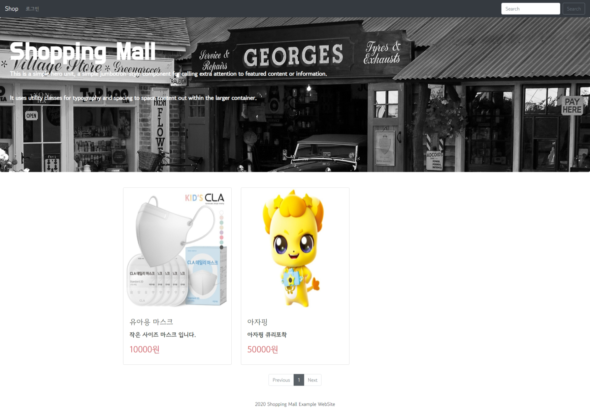
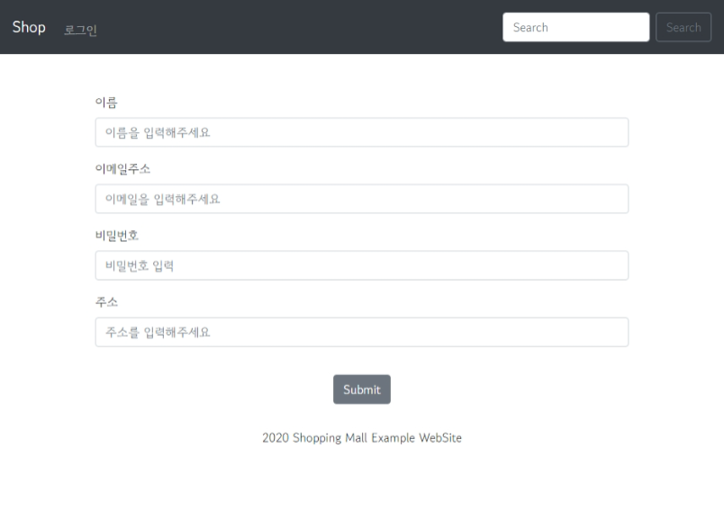
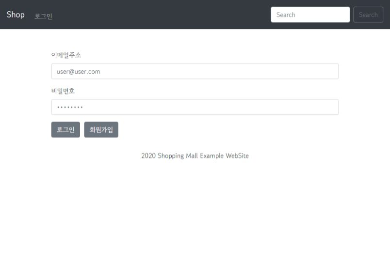
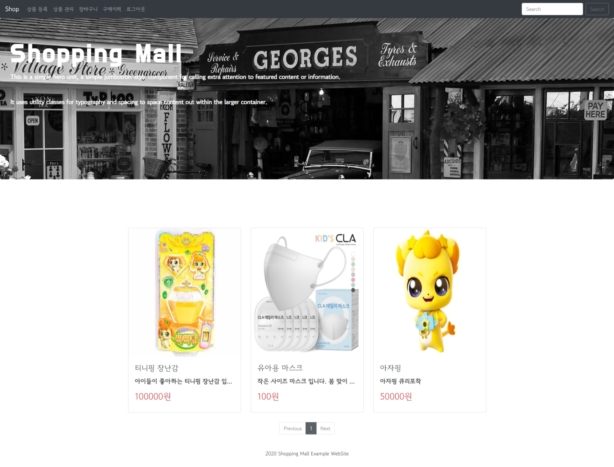
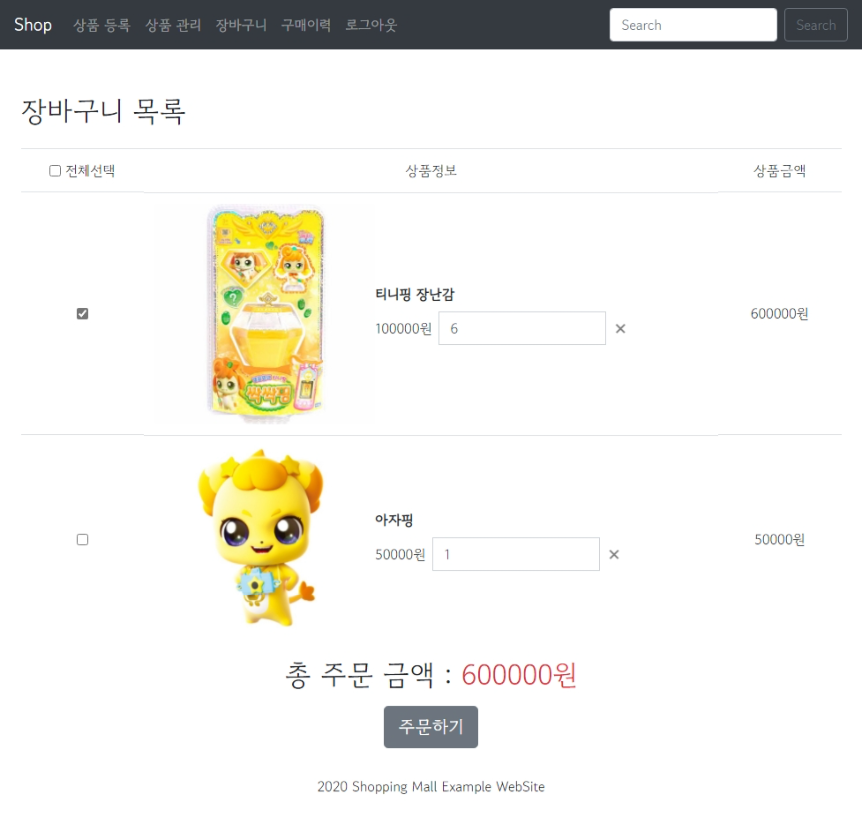

# 🛒SpringBoot ShoppingMall Project

## 🗨 서비스 설명

springboot 로 구현한 쇼핑몰 입니다.

## ⚙ 기술 스택
### FE
- thymeleaf
- html, css, js
- bootStrap

### BE
- SpringBoot
- JPA
- MySQL

### 사용기술
- MVC pattern
- CRUD
- spring security
- image 업로드

## 👀 View Page
### signUp
쇼핑몰의 회원가입 페이지 입니다.   

### logIn
쇼핑몰의 로그인 페이지 입니다.   

### 상품등록
인가된 회원은 쇼핑몰에서 상품을 등록할 수 있습니다.   

상품이미지1 은 not null 입니다.   
상품이미지1 는 상품의 대표이미지로 자동 등록 됩니다.   

 

### 상품관리
등록한 상품들의 목록을 볼 수 있습니다.   

### 상품수정
상품 관리 페이지에서 상품 이름을 클릭하면   
상품 수정 페이지로 이동합니다.   

### 상품디테일
메인 화면에서 상품을 클릭하면   
상품 디테일 화면으로 이동합니다.   

상품 디테일 화면에서는    
상품 등록 시 설정한 이미지 파일들이 순서대로 출력됩니다.  

원하는 수량을 담은 후 장바구니 담기를 누르면    
상품이 장바구니에 담깁니다.   
장바구니에 담지 않고 바로 주문하기를 누를 수도 있습니다.   

### 장바구니
현재 장바구니에 담긴 상품들을 볼 수 있습니다.   
체크박스로 주문 상품을 고를 수 있으며   
x 버튼을 눌러 상품을 제거할 수도 있습니다.

상품을 다 고르면 하단에 총 주문 금액이 출력됩니다.   

### 구매이력 
상품을 구매했을 때의 이력을 확인할 수 있습니다.   
주문 취소 버튼을 클릭해서 주문을 취소할 수 있습니다.

